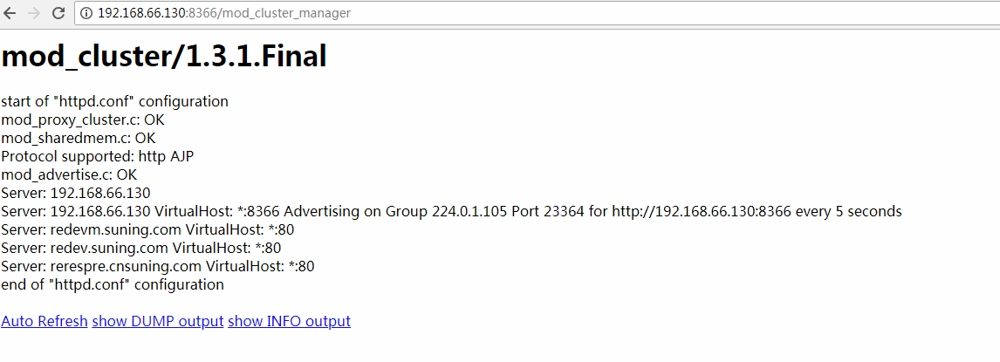

[toc]

## 开发环境
Jdk 1.8
Centos7
wildfly-8.2.1.Final

apache：192.168.66.130
本机：192.168.159.1

概述
### centos安装mod_cluster 和apache

**1.下载mod_cluster**

将[mod_cluster-1.3.1.Final-linux2-x64-ssl.tar.gz ](http://mod-cluster.jboss.org/mod_cluster/downloads/1-3-1-Final-bin),解压到根目录，自带httpd模块,执行/opt/jboss/httpd/sbin/installhome.sh，生成默认配置文件


**2.修改httpd.conf**

$ vim /opt/jboss/httpd/httpd/conf/httpd.conf

``` xml
52   Listen 192.168.66.130:80

173  LoadModule rewrite_module /opt/jboss/httpd/lib/httpd/modules/mod_rewrite.so

216 ServerName 192.168.66.130:80


222 <Directory />
223      Options FollowSymLinks
224      AllowOverride All
225 </Directory>

488 # Virtual hosts
489 Include conf/extra/httpd-vhosts.conf

529 # Adjust to you hostname and subnet.
530 <IfModule manager_module>
531  Listen 192.168.66.130:8366
532  ManagerBalancerName mycluster
533  <VirtualHost *:8366>
534  
535    <Location />
536         Require all granted
537     </Location> 
538    KeepAliveTimeout 300
539    MaxKeepAliveRequests 0
540    #ServerAdvertise on http://127.0.0.1:6666
541    AdvertiseFrequency 5
542    #AdvertiseSecurityKey 1234567890
543    #AdvertiseGroup 224.0.1.105:23364
544    EnableMCPMReceive
545    AllowDisplay On
546    <Location /mod_cluster_manager>
547       SetHandler mod_cluster-manager
548       Require all granted
549    </Location>
550  </VirtualHost>
551 </IfModule>
```
**3.启动**

$ /opt/jboss/httpd/sbin/apachectl start
http://192.168.66.130:8366/mod_cluster_manager



###  本机安装wildfly-8.2.1.Final


``` xml
<subsystem xmlns="urn:jboss:domain:modcluster:1.2">
      <mod-cluster-config advertise-socket="modcluster" proxy-list="192.168.66.130:8366" advertise-security-key="1234567890" excluded-contexts="invoker,jbossws,juddi,console" auto-enable-contexts="true" connector="ajp">
        <dynamic-load-provider>
          <load-metric type="cpu" />
          <load-metric type="busyness" />
        </dynamic-load-provider>
      </mod-cluster-config>
    </subsystem>
	
	
	
  <interfaces>
    <interface name="management">
      <inet-address value="${jboss.bind.address.management:192.168.159.1}" />
    </interface>
    <interface name="public">
      <inet-address value="${jboss.bind.address:192.168.159.1}" />
    </interface>
    <interface name="unsecure">
      <inet-address value="${jboss.bind.address.unsecure:192.168.159.1}" />
    </interface>
    <interface name="any">
      <any-ipv4-address />
    </interface>
  </interfaces>
```


[Apache主配置文件httpd.conf 详解](https://www.linuxidc.com/Linux/2015-02/113921.htm)

[centOS 7 Apache服务的安装与配置](http://blog.51cto.com/13525470/2070375)

[Linux中Apache(httpd)安装、配置、加为服务](https://blog.csdn.net/u010297957/article/details/50751656)
http://middlewaremagic.com/jboss/?p=1952

[JBoss 系列二：使用Apache httpd(mod_cluster)和JBoss构架高可用集群环境](https://blog.csdn.net/kylinsoong/article/details/12292707/)

[Jboss7集群配置说明](https://blog.csdn.net/xixixi9988/article/details/21651449)
[Apache的Rewrite详解](https://www.jianshu.com/p/103742cccaff)

