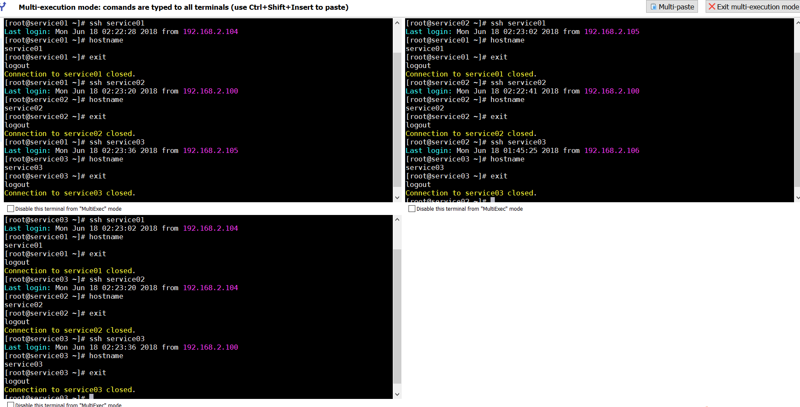
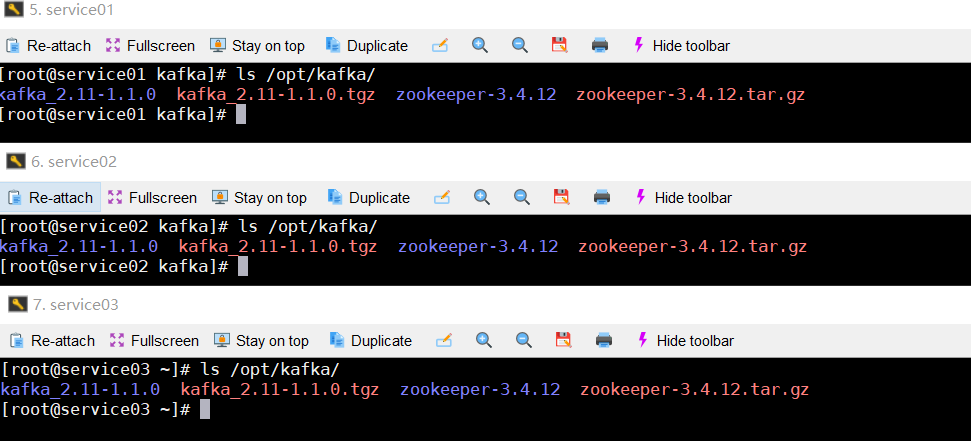

 
使用Clustershell搭建Kafka和Zookeeper集群
[toc]
### 一 、安装环境

虚拟机环境，共有三台虚拟主机： 
192.168.2.104 service01
192.168.2.105 service03
192.168.2.100 service02
### 二、SSH客户端

MobaXterm支持多分屏显示，方便管理多台服务器，并且你可以仅输入一次，让一条命令同时在这些不同的服务器终端执行


### 三、搭建zookeeper集群


#### 3.1 配置域名解析
在mobaxtrem多执行窗口下，修改/etc/host ,新增三台虚拟主机的ip地址与对应域名

``` lsl
192.168.2.104 service01
192.168.2.100 service02
193.192.168.2.105 service03
```

#### 3.2 设置多台机器免密码


``` vbnet
[root@service01 ~]# ls /root/.ssh/
authorized_keys  id_rsa  id_rsa.pub  known_hosts
//删除原有文件
[root@service01 ~]# rm -rf /root/.ssh
/生成rsa密钥文件
[root@service01 ~]# ssh-keygen -t rsa
Generating public/private rsa key pair.
Enter file in which to save the key (/root/.ssh/id_rsa):
Created directory '/root/.ssh'.
Enter passphrase (empty for no passphrase):
Enter same passphrase again:
Your identification has been saved in /root/.ssh/id_rsa.
Your public key has been saved in /root/.ssh/id_rsa.pub.
The key fingerprint is:
SHA256:2cCjwHxLuWpwjQNN6/YAK7HSx7FeSFNo69b0krZ49D8 root@service01
The key's randomart image is:
+---[RSA 2048]----+
|    ...          |
|   =oo o         |
|. o.X.+ +        |
| + B.@.+ =       |
|+ +.%o*oS .      |
|.. *o** .        |
|   .++.+         |
|   .. o . E      |
|     .   ...     |
+----[SHA256]-----+
//查看是否生成了密钥文件
[root@service01 ~]# ls /root/.ssh
authorized_keys  id_rsa  id_rsa.pub  known_hosts
//向主机一发送密钥文件
[root@service01 ~]# ssh-copy-id -i /root/.ssh/id_rsa.pub service01
/usr/bin/ssh-copy-id: INFO: Source of key(s) to be installed: "/root/.ssh/id_rsa.pub"
The authenticity of host 'service01 (192.168.2.104)' can't be established.
ECDSA key fingerprint is SHA256:3ovF0ttLqSQEZclZo65MxpN/GhHSWLUcgbcbcqEON1U.
ECDSA key fingerprint is MD5:b4:9a:db:5e:44:9f:31:7b:6e:91:0e:0c:b4:ff:30:2f.
Are you sure you want to continue connecting (yes/no)? yes
/usr/bin/ssh-copy-id: INFO: attempting to log in with the new key(s), to filter out any that are already installed
/usr/bin/ssh-copy-id: INFO: 1 key(s) remain to be installed -- if you are prompted now it is to install the new keys
root@service01's password:

Number of key(s) added: 1

Now try logging into the machine, with:   "ssh 'service01'"
and check to make sure that only the key(s) you wanted were added.

[root@service01 ~]# ssh-copy-id -i /root/.ssh/id_rsa.pub service02
/usr/bin/ssh-copy-id: INFO: Source of key(s) to be installed: "/root/.ssh/id_rsa.pub"
The authenticity of host 'service02 (192.168.2.100)' can't be established.
ECDSA key fingerprint is SHA256:3ovF0ttLqSQEZclZo65MxpN/GhHSWLUcgbcbcqEON1U.
ECDSA key fingerprint is MD5:b4:9a:db:5e:44:9f:31:7b:6e:91:0e:0c:b4:ff:30:2f.
Are you sure you want to continue connecting (yes/no)? yes
/usr/bin/ssh-copy-id: INFO: attempting to log in with the new key(s), to filter out any that are already installed
/usr/bin/ssh-copy-id: INFO: 1 key(s) remain to be installed -- if you are prompted now it is to install the new keys
root@service02's password:

Number of key(s) added: 1

Now try logging into the machine, with:   "ssh 'service02'"
and check to make sure that only the key(s) you wanted were added.

[root@service01 ~]# ssh-copy-id -i /root/.ssh/id_rsa.pub service03
/usr/bin/ssh-copy-id: INFO: Source of key(s) to be installed: "/root/.ssh/id_rsa.pub"
The authenticity of host 'service03 (192.168.2.105)' can't be established.
ECDSA key fingerprint is SHA256:3ovF0ttLqSQEZclZo65MxpN/GhHSWLUcgbcbcqEON1U.
ECDSA key fingerprint is MD5:b4:9a:db:5e:44:9f:31:7b:6e:91:0e:0c:b4:ff:30:2f.
Are you sure you want to continue connecting (yes/no)? yes
/usr/bin/ssh-copy-id: INFO: attempting to log in with the new key(s), to filter out any that are already installed
/usr/bin/ssh-copy-id: INFO: 1 key(s) remain to be installed -- if you are prompted now it is to install the new keys
root@service03's password:

Number of key(s) added: 1

Now try logging into the machine, with:   "ssh 'service03'"
and check to make sure that only the key(s) you wanted were added.

//检查三个主机的密钥信息是否已经全部同步

[root@service01 ~]#  cat /root/.ssh/authorized_keys
ssh-rsa AAAAB3NzaC1yc2EAAAADAQABAAABAQC6x1LuXZQhziJBkppjFVOjawG7MjY7W/F5UKVa2G6fsT2sqYfEgAcYFemmpC9cM/P0bBeMF0NDjyCjZGiHHhB1rXox3Ott6Dp/+6AoZt4rj4NBgiddLkfIyJxaJDjzXV7nIBOLPpYF/wAQGgQ37p8C52ffILyRGZqXZKC3RH5CMI8RaHraDl57dkRksdMQFbZbl/9vDZALSPdMkjiD/OEcov4nEknTMG4da05MHU2Ny1wgzWP+728yc4L8boZ07q5Rn+1CQCTm0sQ1X6twN9wMXD3vvb96USJlvXyHHrR573A2st3zQKDcNSPr563ODzp7GYh0Kyd4GlBnh7KgWYp9 root@service03
ssh-rsa AAAAB3NzaC1yc2EAAAADAQABAAABAQCuFQ/re/rOpU7OSK5cCBk94Vqqt/UAeLbM+K4H4w6mKH4TJoRUCCa2e7GSc/J1jucKt8S6K2hsYVZjVulQiNEl6RSGkk13oQBm8CHXDElrp7vQSBK19n1t71NaL4YQdEtyXVQbNf73BtlNH6k1sEkb5YtC00g++fUzZgKseyKTKLn52+cQhWxRXBvh1rqKb0B+s3QgYxswy87FEcpqP9e0A/NhqC4ypxad1x7q+/ipmTWnvTQSN8q/h196x6VyupNkLMlKoHBKamNLeU2SR7ooPDJNLxPYRPUhNJBRgbyP1FodOhrEY7wUOPg0xJXhox5R3auNxgUaS/Hi/h7dqE6B root@service01
ssh-rsa AAAAB3NzaC1yc2EAAAADAQABAAABAQCyYUBSxjPI7QXS3huOdBpOOWahT21vGI6dmh2f1bckODwcDbxiDBcP5L3x1OIwqMI99+Z+QPli+6PnCwaWqJCvEuQPTbWh//SVUIxdE3AXHcTpQ40pgZF35sewGV7+AlVLwnGadqS+1b5jb2+P/ebZ37sv/IqMBihWtCfT41bKyGa0zegCkQQai8Hk4fUuc/641By2KndDuXfTOAp+ULqf/hwzt9EVqGN4q2oYFCMDmkByqNJC7HLsvrUSpljg/ReOjJegBFrFbmXlSb0ZXMrKnhZk0/5V/HFaFWESdCGA+2ouxAKBzp7Jy15FMZu1iPk60V52Kg7XyDccTEh6whxz root@service02


```
	检查免密登录情况 



#### 3.3 设置zookeeper集群


1. 在主机1中安装clustershell工具

[操作文档]<http://clustershell.readthedocs.io/en/latest/install.html#red-hat-enterprise-linux-and-CentOS>

	[root@service01 ~]# yum --enablerepo=extras install epel-release
	[root@service01 ~]# yum install clustershell

2. 在/etc/clustersheel目录下建立groups文件

``` vim
	[root@service01 ~]# cd  /etc/clustersheel
	[root@service01 ~]# vi groups
	kafka: service[01,02,03]
	注：service是主机名的前缀
```


3. 在主机1中下载和解压安装包

``` vim
[root@service01 ~]mkdir /opt/kafka && cd /opt/kafka&&wget -O  kafka_2.11-1.1.0.tgz http://mirrors.tuna.tsinghua.edu.cn/apache/kafka/1.1.0/kafka_2.11-1.1.0.tgz && tar -zxvf kafka_2.11-1.1.0.tgz
[root@service01 kafka]wget -O  zookeeper-3.4.12.tar.gz  https://mirrors.tuna.tsinghua.edu.cn/apache/zookeeper/zookeeper-3.4.12/zookeeper-3.4.12.tar.gz &&  tar -zxvf zookeeper-3.4.12.tar.gz
```
4. 通过clustershell统一拷贝zookeeper和 kafaka的安装包

``` vim
[root@service01 kafka]# clush -g kafka -c /opt/kafka/
clush: 1/3
```


5. 验证是否拷贝成功



6. 修改zookeeper的[配置文件](https://zookeeper.apache.org/doc/r3.4.12/zookeeperStarted.html)
 
 （1）修改每台主机的zoo.cfg中的zoo.cfg文件,增加集群信息
``` vim
[root@service01 conf]# cd /opt/kafka/zookeeper-3.4.12/conf/
[root@service01 conf]# cp zoo_sample.cfg zoo.cfg

[root@service01 conf]# vi zoo.cfg
server.1=service01:2888:3888
server.2=service02:2888:3888
server.3=service03:2888:3888
##注：2888端口是作为leader与follow间通讯的，3888端口是作为leader选举的。
```
（2）同步zookeeper的配置文件

``` vim
[root@service01 conf]# clush -g kafka -c /opt/kafka/zookeeper-3.4.12/conf/zoo.cfg
```
（3）创建zookeeper数据目录

``` vim
[root@service01 conf]# clush -g kafka mkdir /tmp/zookeeper
```

(4) 在每台机器中建立myid文件

``` autoit
主机1执行
[root@service01 conf]# echo "1" >/tmp/zookeeper/myid

主机2执行
[root@service02 conf]# echo "2" >/tmp/zookeeper/myid

主机3执行
[root@service03conf]# echo "3" >/tmp/zookeeper/myid

 主机1上验证
[root@service01 conf]# clush -g kafka cat /tmp/zookeeper/myid
service01: 1
service03: 3
service02: 2
```
(5) 启动zookeeper集群，在主机1上执行[需先关闭防火墙]


``` dts
[root@service01 conf]# clush -g  kafka "/opt/kafka/zookeeper-3.4.12/bin/zkServer.sh start /opt/kafka/zookeeper-3.4.12/conf/zoo.cfg"
service03: ZooKeeper JMX enabled by default
service03: Using config: /opt/kafka/zookeeper-3.4.12/conf/zoo.cfg
service01: ZooKeeper JMX enabled by default
service01: Using config: /opt/kafka/zookeeper-3.4.12/conf/zoo.cfg
service02: ZooKeeper JMX enabled by default
service02: Using config: /opt/kafka/zookeeper-3.4.12/conf/zoo.cfg
service03: Starting zookeeper ... STARTED
service01: Starting zookeeper ... STARTED
service02: Starting zookeeper ... STARTED
```

查看监听的端口状态是否正常

``` css
[root@service01 conf]# clush -g kafka lsof -i:2181[2888,3888]
```
#连接第一个主机的zookeeper，建立测试键值进行测试

``` less
[root@service01 zookeeper-3.4.12]# bin/zkCli.sh  -server service01:2181


Connecting to service01:2181


[zk: service01:2181(CONNECTED) 0] ls /
[zookeeper]
[zk: service01:2181(CONNECTED) 1] create /test_install hello
Created /test_install
[zk: service01:2181(CONNECTED) 2] ls /
[test_install, zookeeper]
```

#连接第二个主机的zookeeper，查看测试键值是否存在

``` less
[root@service01 zookeeper-3.4.12]# bin/zkCli.sh  -server service02:2181

[zk: service02:2181(CONNECTED) 1] ls /
[test_install, zookeeper]
```

3.4  建立kafka集群  

（1） 修改kafka配置

修改第一台主机中kafka目录的config子目录中的server.properties配置文件

``` groovy
zookeeper.connect=service01:2181,service02:2181,service03:2181
```


将server.properties配置文件分发到其他两台主机中

``` lsl
[root@service01 config]# clush -g kafka -c /opt/kafka/kafka_2.11-1.1.0/config/server.properties
```


分别修改三台主机的server.properties配置文件，配置不同的broker.id

第一台主机的broker.id设置为broker.id=1
第二台主机的broker.id设置为broker.id=2
第三台主机的broker.id设置为broker.id=3


（2）启动kafka集群

``` lsl
[root@service01 config]# clush -g kafka /opt/kafka/kafka_2.11-1.1.0/bin/kafka-server-start.sh -daemon /opt/kafka/kafka_2.11-1.1.0/config/server.properties
```


验证9092端口


``` less
[root@service01 config]# clush -g kafka lsof -i:9092
service02: COMMAND  PID USER   FD   TYPE DEVICE SIZE/OFF NODE NAME
service02: java    6440 root   97u  IPv6  66337      0t0  TCP *:XmlIpcRegSvc (LISTEN)
service02: java    6440 root  113u  IPv6  66343      0t0  TCP service02:44334->service02:XmlIpcRegSvc (ESTABLISHED)
service02: java    6440 root  114u  IPv6  66344      0t0  TCP service02:XmlIpcRegSvc->service02:44334 (ESTABLISHED)
service02: java    6440 root  118u  IPv6  66346      0t0  TCP service02:44966->service01:XmlIpcRegSvc (ESTABLISHED)
service02: java    6440 root  122u  IPv6  66348      0t0  TCP service02:59148->service03:XmlIpcRegSvc (ESTABLISHED)
service01: COMMAND  PID USER   FD   TYPE DEVICE SIZE/OFF NODE NAME
service01: java    7206 root   97u  IPv6  72885      0t0  TCP *:XmlIpcRegSvc (LISTEN)
service01: java    7206 root  107u  IPv6  72889      0t0  TCP service01:XmlIpcRegSvc->service02:44966 (ESTABLISHED)
service03: COMMAND  PID USER   FD   TYPE DEVICE SIZE/OFF NODE NAME
service03: java    6335 root  152u  IPv6  66170      0t0  TCP *:XmlIpcRegSvc (LISTEN)
service03: java    6335 root  162u  IPv6  66174      0t0  TCP service03:XmlIpcRegSvc->service02:59148 (ESTABLISHED)
```


（3）测试

建立测试topic


``` brainfuck
[root@service01 config]# /opt/kafka/kafka_2.11-1.1.0/bin/kafka-topics.sh --zookeeper service01:2181 --topic topic1 --create --partitions 3 --replication-factor 2
Created topic "topic1".
```


``` yaml
[root@service01 config]# /opt/kafka/kafka_2.11-1.1.0/bin/kafka-topics.sh --zookeeper service01:2181 --topic topic1 --describe
Topic:topic1    PartitionCount:3        ReplicationFactor:2     Configs:
        Topic: topic1   Partition: 0    Leader: 1       Replicas: 1,2   Isr: 1,2
        Topic: topic1   Partition: 1    Leader: 2       Replicas: 2,3   Isr: 2,3
        Topic: topic1   Partition: 2    Leader: 3       Replicas: 3,1   Isr: 3,1
```

订阅topic

``` elixir
[root@service01 config]# /opt/kafka/kafka_2.11-1.1.0/bin/kafka-console-consumer.sh --zookeeper service01:2181 --topic topic1
```


生产message

``` vim
[root@service02 ~]# /opt/kafka/kafka_2.11-1.1.0/bin/kafka-console-producer.sh  --broker-list service02:9092 --topic topic1
```


参考：

https://www.linuxidc.com/Linux/2017-03/141296.htm
[使用Clustershell搭建Kafka和Zookeeper集群](https://www.linuxidc.com/Linux/2016-11/136820.htm)

[运维利器-ClusterShell集群管理](https://blog.csdn.net/fanren224/article/details/73320749)

[CentOS之——CentOS7安装iptables防火墙](https://blog.csdn.net/l1028386804/article/details/50779761)

[zookeeper之 zkServer.sh命令、zkCli.sh命令、四字命令](https://www.cnblogs.com/andy6/p/7674028.html)


